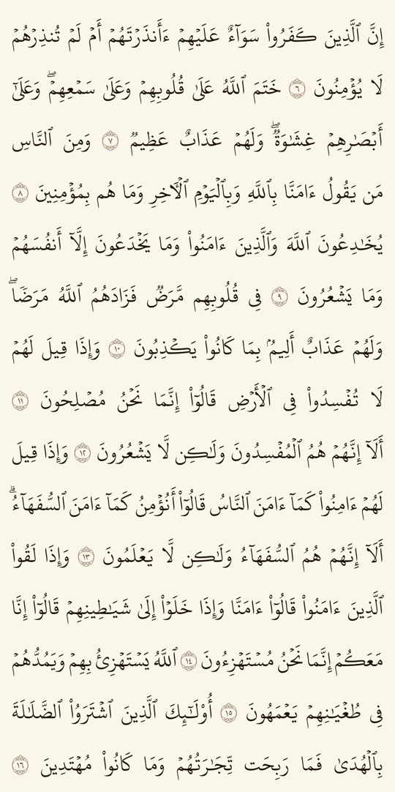
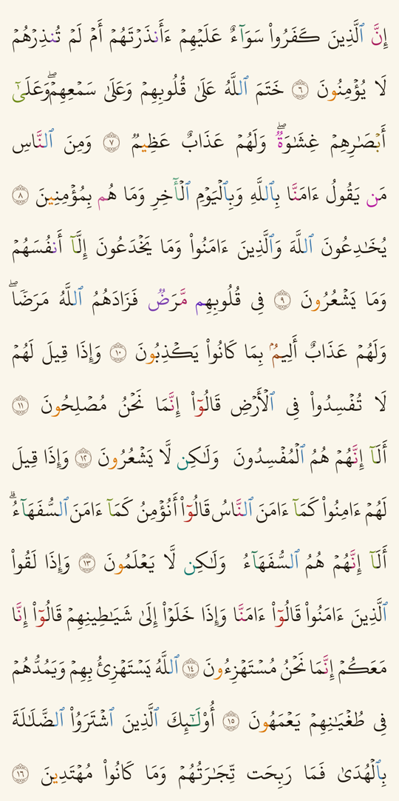
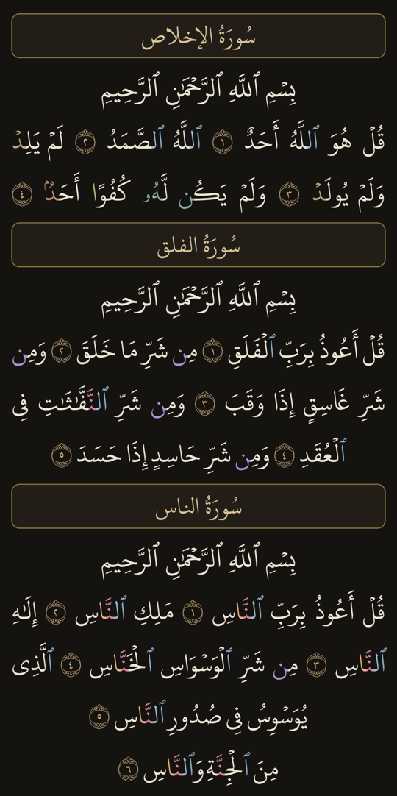

# mushaf-text

[](https://jitpack.io/#sherifshabans/mushaf-text)
[](https://pub.dev/packages/mushaf_text)

مصحف المدينة **كنصّ** (لا صور) في Jetpack Compose — الصفحة مطابقة للمطبوع سطرًا
بسطر، بخط مجمّع الملك فهد، ومعه وضع **مصحف التجويد** بالألوان، وكل حكم يحمل مرجعه.
وفي `flutter/` نفس المحرّك لـFlutter، منشورًا على pub.dev باسم
[`mushaf_text`](https://pub.dev/packages/mushaf_text).

The Madinah Mushaf rendered as **text** in Jetpack Compose — every page laid out
line-for-line like the printed copy, in the King Fahd Complex font, with an
optional colour-coded **tajweed** mode in which every rule carries its source.
`flutter/` holds the same renderer for Flutter, published on pub.dev as
[`mushaf_text`](https://pub.dev/packages/mushaf_text).

| عادي · Plain | تجويد · Tajweed | ليلي · Night |
|---|---|---|
|  |  |  |

**بالعربي**

- ٦٠٤ صفحات، ١٥ سطرًا، وكسر السطور **نفس** المطبوع لا تقديرًا له — والسطور
  الممدودة والمتوسّطة مقيسة من صور المصحف.
- خط **KFGQPC HAFS Uthmanic Script** — التنوين المرصوص والوردة برقمها مضبوطان.
- ٢٦ حكم تجويد، لكل حكم لونه، ولمس الحرف الملوّن يعطيك الحكم وشرحه **ومرجعه**.
  والتلوين **لا يحرّك** حرفًا واحدًا في الصفحة، وذلك مثبَّت باختبار.
- يعمل بلا إنترنت تمامًا: النصّ والخط والتخطيط داخل المكتبة. لا شبكة ولا API.

**In English**

- 604 pages, 15 lines each, and the line breaks are **the printed ones**, not an
  approximation — the stretched and half-width lines were measured from images
  of the mushaf.
- The **KFGQPC HAFS Uthmanic Script** font, so the stacked tanween and the
  numbered ayah rosette come out right.
- 26 tajweed rules, a colour each. Tapping a coloured letter returns the rule,
  its explanation and **its reference**. Colouring **moves nothing** on the
  page, and a test pins that.
- Fully offline: text, font and layout all ship inside the library. No network,
  no API.

## التثبيت · Installation

**1.** أضف JitPack في `settings.gradle.kts` · Add JitPack to `settings.gradle.kts`:

```kotlin
dependencyResolutionManagement {
    repositories {
        google()
        mavenCentral()
        maven { url = uri("https://jitpack.io") }
    }
}
```

**2.** أضف المكتبة في `build.gradle.kts` الخاص بالموديول · Add the library to
your module's `build.gradle.kts`:

```kotlin
dependencies {
    implementation("com.github.sherifshabans:mushaf-text:1.2.0")
}
```

Groovy (`build.gradle`):

```groovy
repositories { maven { url 'https://jitpack.io' } }
dependencies { implementation 'com.github.sherifshabans:mushaf-text:1.2.0' }
```

المتطلبات: `minSdk 21` وJetpack Compose. والمكتبة تزيد حجم التطبيق نحو ١٫٧ ميجا
(النصّ ١٫٤ + الخط ٠٫٢٤).

Requirements: `minSdk 21` and Jetpack Compose. The library adds about 1.7 MB to
an app (1.4 MB of text plus a 0.24 MB font).

## الاستخدام · Usage

### المصحف كاملًا، صفحةً بصفحة · The whole mushaf, page by page

```kotlin
MushafPager(
    modifier = Modifier.fillMaxSize(),
    state = rememberMushafPagerState(initialPage = 1),   // رقم الصفحة ١‥٦٠٤ · page 1..604
    tajweed = false,                                     // true = مصحف التجويد
    colors = MushafColors.Light,                         // أو MushafColors.Dark
    onAyahClick = { ayah -> /* ayah.surah, ayah.number, ayah.text */ }
)
```

الصفحات تُقلَب من اليمين إلى الشمال كالمصحف المطبوع مهما كانت لغة التطبيق.

Pages turn right to left like the printed copy, whatever the app's locale.

### صفحة واحدة · A single page

```kotlin
MushafPage(
    page = 50,
    modifier = Modifier.fillMaxSize().background(MushafColors.Light.paper),
    tajweed = true
)
```

الصفحة تأخذ أكبر حجم خطٍّ يُدخل أعرضَ سطرٍ في العرض المتاح، وتتجاهل حجم خط النظام
عن قصد: هي نسخة من صفحة مطبوعة، والتكبير يكسر الخمسة عشر سطرًا. فإن أردت نصًّا
يكبر مع إعدادات القارئ فاستعمل `QuranText`.

The page picks the largest font size that fits its widest line into the width it
is given, and ignores the system font scale on purpose: it is a copy of a printed
page, and scaling breaks the fifteen lines. For text that follows the reader's
own settings, use `QuranText`.

### مصحف التجويد · Tajweed mode

```kotlin
var hit by remember { mutableStateOf<TajweedHit?>(null) }

MushafPage(
    page = 3,
    tajweed = true,
    naturalMadd = false,          // المدّ الطبيعي مغلق افتراضيًا — يصبغ الصفحة كلها
    tafkhim = false,              // التفخيم والترقيق كذلك — نحو ٣٠ ألف موضع
    onTajweedClick = { hit = it } // لُمس حرف ملوّن · a coloured letter was tapped
)

hit?.let {
    Text("${it.rule.label}: ${it.rule.definition} — ${it.rule.amount}")
    Text("${it.rule.source}\n${it.rule.evidence}")   // المرجع ونصّه · the reference
}

TajweedLegend()                   // مفتاح الألوان · the colour key
```

كل `TajweedRule` يحمل: `label` (الاسم بالعربي)، و`englishName`، و`definition`،
و`amount` (المقدار)، و`letters`، و`color`، و`source` و`evidence` (المرجع ونصّه).

Every `TajweedRule` carries `label` (its Arabic name), `englishName`,
`definition`, `amount`, `letters`, `color`, and `source` / `evidence` — the
reference and the verse it comes from.

ولتغيير ألوان أحكام بعينها · To override individual rule colours:

```kotlin
val colors = MushafColors.Light.copy(
    tajweed = mapOf(TajweedRule.GHUNNA to Color(0xFFE91E63))
)
```

و`focusRule` + `focusIndex` يضعان إطارًا حول موضع حكمٍ بعينه على الصفحة، وهو مفيد
لشاشة «أحكام هذه الصفحة».

`focusRule` and `focusIndex` frame one occurrence of a rule on the page — what a
"rules on this page" screen needs to walk through them.

### تظليل الآيات · Highlighting ayahs

```kotlin
MushafPage(
    page = 2,
    selectedAyahIds = setOf(ayahId),
    highlightedAyahs = mapOf(ayahId to Color.Yellow),   // علامات المستخدم · user marks
    playingAyahIds = setOf(nowPlayingId),               // الآية المتلوّة — لها الأولوية
    onAyahClick = { },
    onAyahLongClick = { }
)
```

### نصّ متدفّق · Flowing text

آية اليوم، التفسير، نتائج البحث · A verse of the day, tafsir, search results:

```kotlin
val context = LocalContext.current
val kursi = remember { Quran.ayah(context, surah = 2, number = 255) }

kursi?.let { QuranText(ayah = it, fontSize = 22.sp, tajweed = true) }

// أو عدّة آيات في فقرة واحدة، مع لمس الآية
// or several ayahs in one paragraph, each tappable
QuranText(ayahs = Quran.ayahsOfSurah(context, 112), onAyahClick = { })
```

### البيانات · The data

```kotlin
Quran.surahs                         // ١١٤ سورة: الاسم عربي/إنجليزي، عدد الآيات، الصفحات
Quran.page(context, 1)               // آيات صفحة · the ayahs on a page
Quran.ayahsOfSurah(context, 18)
Quran.pageOf(context, 18, 10)        // صفحة آية · which page an ayah is on
Quran.load(context)                  // suspend — كل الآيات (٦٢٣٦) دون تعليق الواجهة
```

أول نداء يقرأ النصّ من الـassets (عشرات الملّي ثانية) وما بعده من الكاش.
و`MushafPage(page = …)` و`MushafPager` يحمّلان وحدهما خارج الـmain thread.

The first call reads the text from assets (tens of milliseconds); everything
after it comes from cache. `MushafPage(page = …)` and `MushafPager` do that load
off the main thread themselves.

## ملاحظات تقنية · Technical notes

- **النصّ** بترميز KFGQPC Hafs (السكون `U+06E1`، والتنوين المرصوص
  `U+0656/0657/065E`)، فلا بدّ أن يُرسم بـ`MushafFont`: أي خط عربي آخر يرسم
  التنوين خطأً.
  <br>*The text uses the KFGQPC Hafs encoding, so it must be drawn with
  `MushafFont`; any other Arabic font renders the tanween wrongly.*
- **علامة نهاية الآية** هي الأرقام وحدها، والخط يطويها في حرف واحد فيه الوردة
  والرقم. وأندرويد يوصّل رَنَّ الأرقام إلى المشكِّل مقلوبًا، فالمكتبة تختار الترتيب
  **بالقياس** — الترتيب الصحيح يُخرج وردةً واحدة بنصف العرض — فتصحّح نفسها على أي
  إصدار.
  <br>*The ayah marker is just the digits; the font folds them into one glyph
  holding the rosette and its number. Android hands the digit run to the shaper
  reversed, so the library picks the order **by measuring** — the right order
  produces a single rosette at half the width — and so corrects itself on any
  release.*
- **أحكام التجويد مستخرجة من رسم النصّ نفسه**، لا من بيانات خارجية: رسم المجمّع
  يفرّق أصلًا بين الإظهار (سكون ظاهر أو تنوين جانبي) والإخفاء والإدغام (نون عارية
  أو تنوين مرصوص) والإقلاب (ميم صغيرة). فلا خطر أن يقع اللون على حرف آخر.
  <br>*The tajweed rules are derived from the script itself, not from an
  imported dataset: the KFGQPC orthography already distinguishes izhar from
  ikhfa, idgham and iqlab — so there is no offset to misalign.*
- **تخطيط السطور** من `layout.txt`: عدد الكلمات على كل سطر في كل صفحة، مشتقًّا من
  رقم السطر لكل كلمة في بيانات quran.com. والاختبارات تتأكّد أن الصفحات الـ٦٠٤
  مطابقة للنصّ كلمةً بكلمة.
  <br>*Line layout comes from `layout.txt` — the word count of every line on
  every page — and the tests check all 604 pages against the text word for
  word.*

## مراجع الأحكام · Where the rulings come from

كل حكم يحمل `source` و`evidence`: اسم المتن ورقم البيت، والبيت بنصّه — ليقابله
القارئ بنفسه بدل أن يصدّقنا.

Every rule carries `source` and `evidence`: the matn, the verse number, and the
verse in its own words — so a reader can check it instead of taking our word.

- **تحفة الأطفال** للجمزوري (ت ١١٩٨ هـ) — أحكام النون الساكنة والتنوين، والميم
  الساكنة، ولام «أل»، والمدود، والمتماثلان والمتجانسان والمتقاربان، واللين.
  <br>*al-Jamzūrī (d. 1198 AH) — noon sākinah and tanwīn, meem sākinah, the lām
  of «أل», and the madd rules.*
- **المقدمة الجزرية** لابن الجزري (ت ٨٣٣ هـ) — القلقلة والغنّة وإخفاء الميم،
  والتفخيم والترقيق: حروف الاستعلاء والراءات ولام لفظ الجلالة.
  <br>*Ibn al-Jazarī (d. 833 AH) — qalqalah, ghunnah, the ikhfāʾ of the meem.*
- **التعريف بمصحف المدينة النبوية** (مجمّع الملك فهد) — علامات الضبط.
  <br>*(King Fahd Complex) — the notation marks.*

ثلاثة أحكام **ليست في المتنين** — مدّ الصلة وهمزة الوصل والألف الزائدة — ومصدرها
يقول ذلك صراحةً بدل أن يأخذ سُلطةً ليست له. والرواية **حفص عن عاصم من طريق
الشاطبية**.

Three rules are in **neither matn** — madd ṣilah, hamzat al-waṣl and the extra
alef — and their `source` says so rather than borrowing an authority it does not
have. The riwāyah is **Ḥafṣ ʿan ʿĀṣim** by the Shāṭibiyyah.

و**المواضع** نفسها مستخرجة من الرسم ومختبَرة على المتن: الإظهار المطلق (تحفة ١١)
مئةٌ وخمسة وعشرون موضعًا كلها بسكون ولا واحد منها ملوّن، وفواتح السور (تحفة ٥٤–٥٦)
تسعٌ وعشرون فاتحة بصفر استثناء.

The **positions** themselves come from the script and are tested against the
matn: iẓhār muṭlaq (Tuhfa v.11) across all 125 positions, and the surah openings
(vv.54–56) across all 29, with no exceptions.

> **تنبيه:** صياغة التعريفات من عندنا ولم يراجعها بعدُ قارئ مُجاز. المواضع
> متحقَّق منها؛ أمّا الصياغة فتستحقّ عين شيخ. انظر
> [`docs/tajweed-review-sheet.md`](docs/tajweed-review-sheet.md).
>
> **Note:** the wording of the explanations is ours and has not yet been
> reviewed by a qualified reciter. The positions are verified; the phrasing
> deserves a teacher's eye. See
> [`docs/tajweed-review-sheet.md`](docs/tajweed-review-sheet.md).

الأحكام الثمانية عشر مولّدة من جدول واحد في
[`tools/gen_tajweed_rules.py`](tools/gen_tajweed_rules.py) إلى مكتبة Kotlin وحزمة
Dart معًا، فلا تفترق النسختان في وصف الحرف نفسه. لا تحرّر `TajweedRules.kt` بيدك.

The 18 rules are generated from one table in
[`tools/gen_tajweed_rules.py`](tools/gen_tajweed_rules.py) into both the Kotlin
library and the Dart package, so the two ports cannot describe the same letter
differently. Do not hand-edit `TajweedRules.kt`.

## ما لا تغطّيه · What it does not cover

الصمت هنا يوحي بالاكتمال، فهذه قائمة ما ليس في المكتبة:

Silence here would imply completeness, so this is what the library does **not**
do:

- **ما لا يتغيّر فيه النطق لا يُلوَّن** عن قصد: الإظهار بأنواعه (الحلقي
  والشفوي والمطلق)، واللام القمرية، ولام الفعل. تلوينها يوهم القارئ أن فيها
  عملًا.
  <br>*Anything that changes nothing in the pronunciation is left uncoloured on
  purpose: all three kinds of izhar, the lunar lam, and the lam of a verb.*
- **السكت** في مواضعه الأربعة عند حفص، و**الإمالة** في ﴿مَجْر۪ىٰهَا﴾،
  و**التسهيل** في ﴿ءَا۬عْجَمِىٌّ﴾، و**الإشمام** في ﴿لَا تَأْمَ۬نَّا﴾ — معلَّمة
  في الرسم ولم تُنفَّذ بعد.
  <br>*The four saktas, the imala, the tasheel and the ishmam are marked in the
  script but not implemented yet.*
- **الروم والإشمام في الوقف**، و**مخارج الحروف وصفاتها** عمومًا — وصفيّة لا
  تُعلَّم على حرف بعينه.
  <br>*Rawm and ishmam at a stop, and the makharij and sifat in general, are
  descriptive and do not attach to one letter.*
- **المقطوع والموصول وهاء التأنيث** — أبواب رسم لا تلوين.
  <br>*The chapters on joined and separated words are about orthography, not
  colouring.*
- **علامات الوقف** تُعرض كما هي ولا يقع عليها لون.
  <br>*The waqf signs are drawn as they are and never take a colour.*

## الاختبارات · Tests

```bash
./gradlew :mushaf:testDebugUnitTest
```

- `MushafLayoutTest` — النصّ كاملًا (٦٢٣٦ آية، ١١٤ سورة) والتخطيط مطابق في الصفحات
  الـ٦٠٤ كلها. *The full text and the layout, page for page.*
- `TajweedAnnotatorTest` — مواضع سليمة على المصحف كلّه، والإظهار لا يُلوَّن، وأمثلة
  لكل حكم. *Correct positions across the whole mushaf; izhar never coloured.*
- `TajweedRenderTest` — التلوين لا يغيّر مقاس كلمة (Skia حقيقية والخط الحقيقي).
  *Colouring changes no measurement, with real Skia and the real font.*
- `MushafRenderHarness` — يرسم صفحات PNG في `mushaf/build/mushaf-shots/` بلا
  محاكٍ. *Renders pages to PNG with no emulator.*

```bash
./gradlew :mushaf:testDebugUnitTest --tests '*MushafRenderHarness*' -Pmushaf.pages=1,50,604
```

وفي `flutter/` · And in `flutter/`:

```bash
cd flutter && flutter test
```

منها `tajweed_parity_test.dart` الذي يثبّت تنفيذ Dart على تنفيذ Kotlin في ٨٥٬٣٨٦
موضعًا عبر الآيات الـ٦٢٣٦، و`tajweed_reference_test.dart` الذي يحاكم الكود إلى
المتون.

Among them `tajweed_parity_test.dart`, which pins the Dart implementation to the
Kotlin one across 85,386 spans in all 6236 verses, and
`tajweed_reference_test.dart`, which holds the code to the matns.

## التطبيق التجريبي · Sample app

`sample/` هو شاشة المصحف كاملة من تطبيق **DailySeventy**، مرسومة بالمكتبة:

`sample/` is the complete mushaf screen from the **DailySeventy** app, drawn
with this library:

- **الفهرس** (السور بأرقامها وصفحاتها) و**البحث** في نصّ الآيات.
  *Surah index and full-text search.*
- **التفسير الميسر** لكل آية، مع النسخ والمشاركة.
  *Tafsir for every ayah, with copy and share.*
- **العلامات**: قرأ / حفظ / مراجعة، أو علامة باسم ولون، وتبويب «علاماتي».
  *Bookmarks, named and coloured, with their own tab.*
- **التلاوة**: سورة كاملة أو «استماع من هذه الآية» بصوت القارئ الذي تختاره، مع
  مشغّل في الإشعار وشاشة القفل، وتنزيل السور للاستماع بلا نت، والمصحف يقلب مع
  التلاوة والآية تُظلَّل.
  *Recitation with a notification and lock-screen player, offline downloads, and
  the page turning along with the reciter.*
- **التجويد**: التلوين، ولمس الحكم لشرحه ومرجعه، و«أحكام هذه الصفحة».
  *Tajweed: the colouring, the rule sheet with its reference, and the rules on
  this page.*
- **المشاركة**: الآيات كنصّ أو كصورة. *Sharing ayahs as text or as an image.*

والصوت يحتاج إنترنت (mp3quran وeveryayah). والـsample وحده هو الذي يعتمد على
Media3 وOkHttp — أمّا المكتبة فلا اعتماديات لها غير Compose.

Audio needs a network (mp3quran and everyayah). Only the sample depends on
Media3 and OkHttp; the library itself depends on nothing but Compose.

## الترخيص · License

الكود · The code: [MIT](LICENSE).

خط **KFGQPC HAFS Uthmanic Script** © مجمّع الملك فهد لطباعة المصحف الشريف، مضمَّن
**بلا أي تعديل** برخصته ([licenses/](licenses/KFGQPC-UthmanicHafs-LICENSE.txt)):
الاستعمال والنسخ والتوزيع مجّانًا، والتعديل والبيع ممنوعان. والنصّ القرآني برواية
حفص عن عاصم برسم مجمّع الملك فهد. وتخطيط السطور مشتقّ من بيانات
[quran.com](https://quran.com).

The **KFGQPC HAFS Uthmanic Script** font is © the King Fahd Complex for the
Printing of the Holy Qur'an, bundled **unmodified** under its own licence: free
to use, copy and redistribute; modification and sale are forbidden. The Qur'anic
text is Ḥafṣ ʿan ʿĀṣim in the King Fahd Complex orthography, and the line layout
is derived from [quran.com](https://quran.com) data.

وفي الـsample وحده: خط Amiri برخصة SIL OFL 1.1
([licenses/](licenses/Amiri-NOTICE.txt))، و«التفسير الميسر» من مجمّع الملك فهد،
وقائمة القرّاء من [mp3quran.net](https://mp3quran.net).

In the sample only: the Amiri font under SIL OFL 1.1, *al-Tafsīr al-Muyassar*
from the King Fahd Complex, and the reciter list from
[mp3quran.net](https://mp3quran.net).
