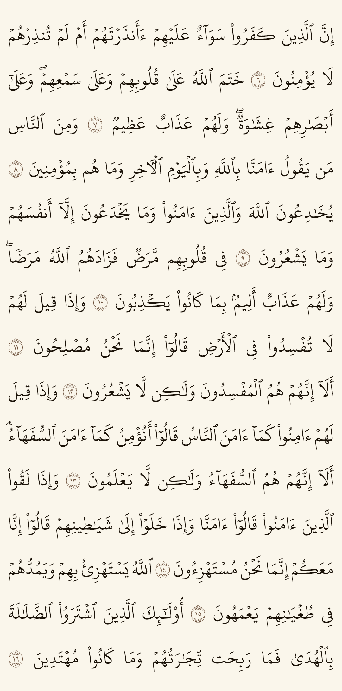
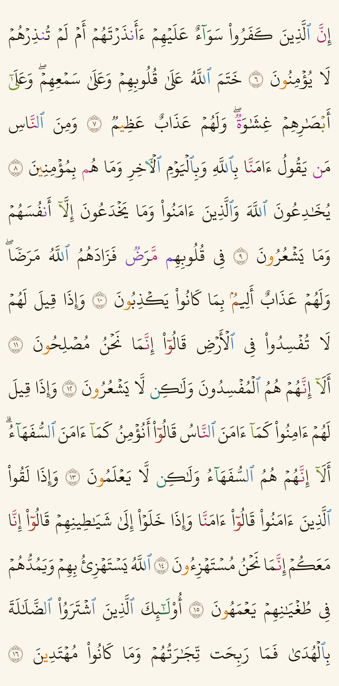

# mushaf_text

مصحف المدينة **كنص** (مش صور) في Flutter — الصفحة مطابقة للمطبوع سطرًا بسطر،
بخط مجمّع الملك فهد، ومعاه وضع **التجويد** بالألوان.

The Madinah Mushaf rendered as **text** in Flutter — every page laid out
line-for-line like the printed copy, in the King Fahd Complex font, with an
optional colour-coded **tajweed** mode.

| عادي · Plain | تجويد · Tajweed |
|---|---|
|  |  |

- ٦٠٤ صفحة، ١٥ سطرًا، وكسر السطور **نفس** المطبوع — مش تقدير. والسطور الممدودة
  والمتوسّطة مقاسة من صور المصحف نفسها.
- خط **KFGQPC HAFS Uthmanic Script** — التنوين المرصوص والوردة برقمها مظبوطين.
- ١٨ حكم تجويد، كل حكم بلونه، ولمس الحرف الملوّن بيرجّع الحكم وشرحه **ومرجعه**
  من تحفة الأطفال أو المقدمة الجزرية برقم البيت ونصّه.
- شغّال أوفلاين بالكامل: النص والخط والتخطيط جوّه الحزمة. مفيش نت ولا API.
- التلوين **مابيحرّكش** ولا حرف في الصفحة — متأكَّد منه بالقياس، مش افتراض.

## Install

```yaml
dependencies:
  mushaf_text: ^1.1.0
```

## Use

```dart
import 'package:mushaf_text/mushaf_text.dart';

ColoredBox(
  color: MushafColors.light.paper,
  child: MushafPage(
    page: 3,
    tajweed: true,
    onTajweedTap: (hit) => showRule(hit.rule),   // tapped a coloured letter
    onAyahTap: (ayahId) => selectAyah(ayahId),
  ),
)
```

The page paints **no background of its own**, so put `MushafColors.paper` — or
your own — behind it, and it composes with any container.

### The text on its own

```dart
final ayahs = await Quran.page(3);
final spans = TajweedAnnotator.annotate(ayahs.first.text);
for (final s in spans) {
  print('${s.rule.label}: ${ayahs.first.text.substring(s.start, s.end)}');
}
```

`Quran.ayahs()`, `Quran.surahAyahs()`, `Quran.ayah(surah, number)` and
`Quran.surahs` give the whole text without drawing anything.

### Colours

`MushafColors.light` and `MushafColors.dark`, or your own. Individual rules can
be overridden:

```dart
MushafColors.light.copyWith(
  tajweedOverrides: {TajweedRule.ikhfa: Colors.deepPurple},
)
```

## Where the tajweed rules come from

Two things have to be right, and they are established separately: **where** a
rule falls, and **what** the rule is.

### Where — from the script itself

**Not from an imported dataset.** The published ones index into the *Tanzil*
Uthmani text while this package carries the *KFGQPC* one, and the two differ in
how they encode the marks themselves — a sukun is `U+06E1` here and `U+0652`
there, and a stacked tanween is written `U+0656`/`U+0657`/`U+065E`. Applying
their offsets unchanged slides the colours onto the wrong letters.

The KFGQPC script already writes these rules out — that is what it is printed
for. Checked across all 6236 verses:

| written as | means | count |
|---|---|---|
| noon with a sukun, or a side-by-side tanween | **izhar**, left uncoloured | 1716 / 1911 |
| a bare noon, or a stacked tanween | ikhfa or idgham | 5139 / 6643 |
| a small high or low meem | **iqlab** | 609 |
| a maddah `U+0653` | a madd longer than two counts | 5652 |
| an upright rectangular zero `U+06E0` | an alef dropped in wasl, kept in waqf | 66 |
| a small waw or yeh | **madd silah** | 2213 |

This Dart implementation produces **identical spans to the Kotlin one for all
6236 verses**, 85,386 of them, which `test/tajweed_parity_test.dart` enforces
against a fixture the Kotlin side writes.

### What — from named references

Every rule carries `source` and `evidence`: the matn it comes from, its verse
number, and the verse in its own words, shown to the reader in the app.

- **تحفة الأطفال والغلمان**, al-Jamzūrī (d. 1198 AH) — the noon sākinah and
  tanwīn rules, the meem sākinah rules, the lām of «أل», and the madd rules.
- **المقدمة الجزرية**, Ibn al-Jazarī (d. 833 AH) — qalqalah, ghunnah, and the
  ikhfāʾ of the meem.
- **التعريف بمصحف المدينة النبوية** (King Fahd Complex) — the notation: the
  upright rectangular zero, the small wāw and yāʾ, and hamzat al-waṣl.

Three rules — madd ṣilah, hamzat al-waṣl and the extra alef — are **not** in
either matn; their `source` says so rather than claiming an authority they do
not have. The riwāyah throughout is **Ḥafṣ ʿan ʿĀṣim** by the Shāṭibiyyah.

`test/tajweed_reference_test.dart` holds the code to those references rather
than to its own habits, over the whole mushaf:

- **Tuhfa v.11** — a noon sākinah meeting a *yanmū* letter **inside one word**
  is iẓhār muṭlaq, not idghām. All 125 positions (دُنْيَا, صِنْوَان, قِنْوَان,
  بُنْيَان) stay uncoloured.
- **Tuhfa vv.54–56** — in the surah openings, only «كم عسل نقص» takes six
  counts; «حي طهر» is a natural madd and the alef takes none. All 29 openings
  agree, with no exceptions.
- **Tuhfa vv.7–8** — no iẓhār ḥalqī is ever coloured.
- **The notation guide** — all 66 extra-alef positions are alef, and the rule
  reads «dropped in waṣl, kept in waqf», not «silent».

> The 18 rulings are now each tied to a named reference, and the positions are
> tested against it. What has still not happened is a **qualified reader**
> reading the 18 explanatory texts end to end. The rulings are sourced; the
> phrasing of the explanations is ours, and a teacher's eye would still be
> worth more than another test.

## Why colouring cannot break the page

A `TextStyle` that sets only a colour changes no metric, so a word measures the
same whether it carries one colour or ten — line breaks, the stretching, and the
font size derived from the widest line all stay exactly put.
`test/mushaf_render_test.dart` measures that with the real font over hundreds of
coloured words rather than assuming it.

One limit is real: a glyph the font folds out of several code points — a
lam-alef ligature — takes **one** colour. That is OpenType, not this package.

## Also for Android

The same renderer for Jetpack Compose lives in this repository as
`com.github.sherifshabans:mushaf-text` on JitPack. The two share their text,
their layout and their tajweed rules, verse for verse.

## Licence

The code is MIT. The bundled **KFGQPC HAFS Uthmanic Script** font is the King
Fahd Complex's: free to use and redistribute, **not** to modify or sell — it
ships here byte for byte. See `licenses/` in the repository root.
